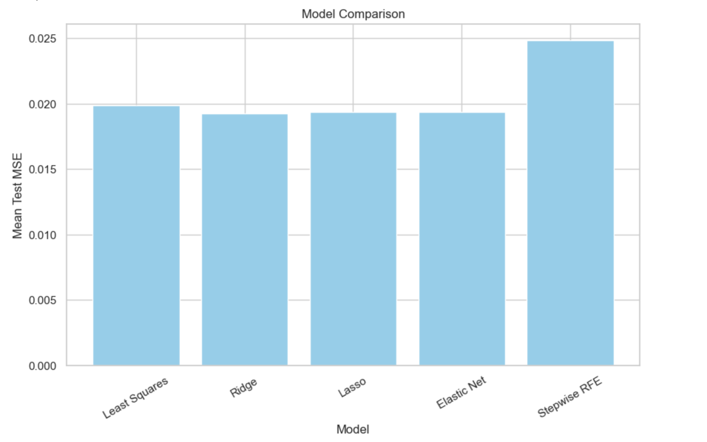
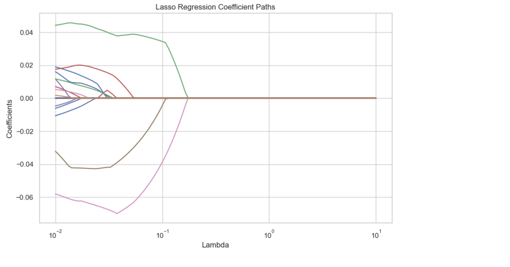
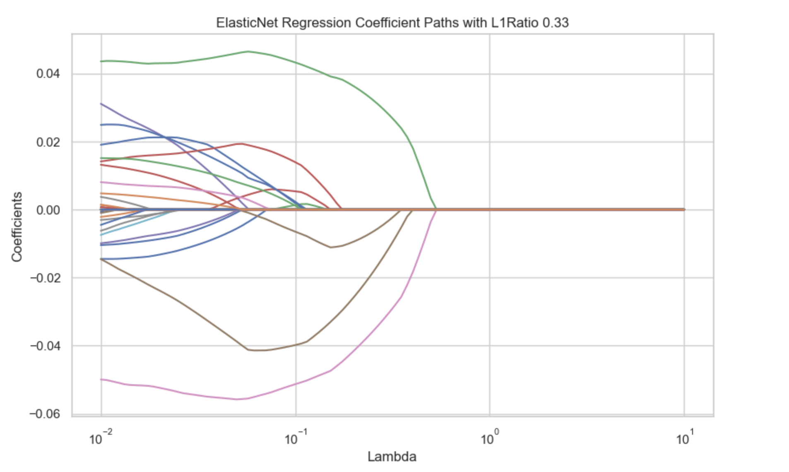
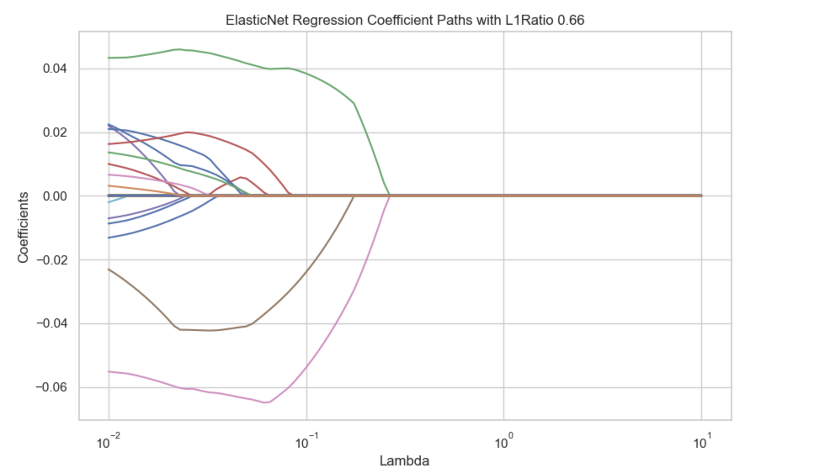
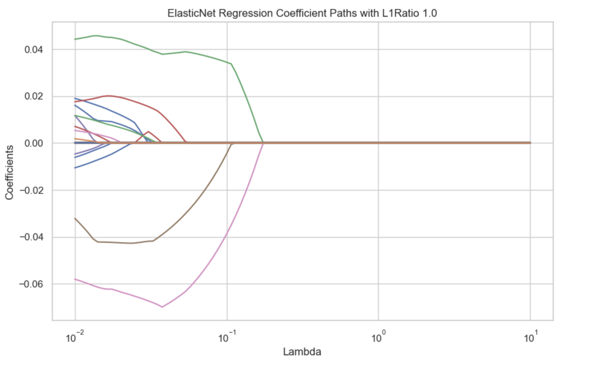
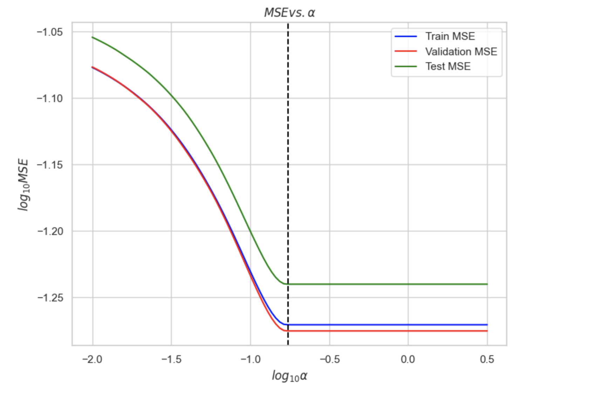

# ml-model-comparison-and-tuning
Compare feature selection techniques and regression models (linear vs. kernel) with custom CV and performance evaluation.

# Regression Model Comparison with Feature Selection and Kernel Methods

This project investigates the impact of different feature selection techniques and regression models on predictive performance. It applies both linear and nonlinear methods on a high-dimensional social indicator dataset, evaluating results through cross-validation and test MSE.

## Overview

We compare a range of regression models:

- **Linear Models**: Ordinary Least Squares (OLS), Ridge, Lasso, Elastic Net
- **Nonlinear Models**: Kernel Ridge Regression with RBF and Polynomial kernels

And apply various feature selection techniques:

- Correlation-based filtering
- OLS Coefficient Ranking
- Lasso & Elastic Net Regularization
- Stepwise Regression
- Recursive Feature Elimination (RFE)

## Highlights

- Selected top 15 features from >100 predictors using multiple selection methods.
- Implemented custom K-Fold cross-validation and compared it with `GridSearchCV`.
- Compared test MSEs across linear and kernel models; RBF kernel ridge achieved the lowest test error.
- Visualized performance using cross-validation error curves and kernel response plots.

## Key Results

| Model                   | Test MSE |
|------------------------|----------|
| OLS                    | 0.0431   |
| Ridge (tuned)          | 0.0378   |
| Lasso                  | 0.0315   |
| Kernel Ridge (Poly)    | 0.0252   |
| **Kernel Ridge (RBF)** | **0.0203** |

## Visualizations

### 1. Model Comparison (Test MSE)
This chart compares the average test MSE for each model after tuning:

### 2. Regularization Paths
The plots below show how Lasso and Elastic Net shrink coefficients to zero as λ increases:

- **Lasso Regression Coefficient Paths**  
  

- **ElasticNet Paths with Different L1 Ratios**  
    
    
  

### 3. Hyperparameter Tuning (RBF Kernel Ridge)
Tuning α using train/val/test split:

